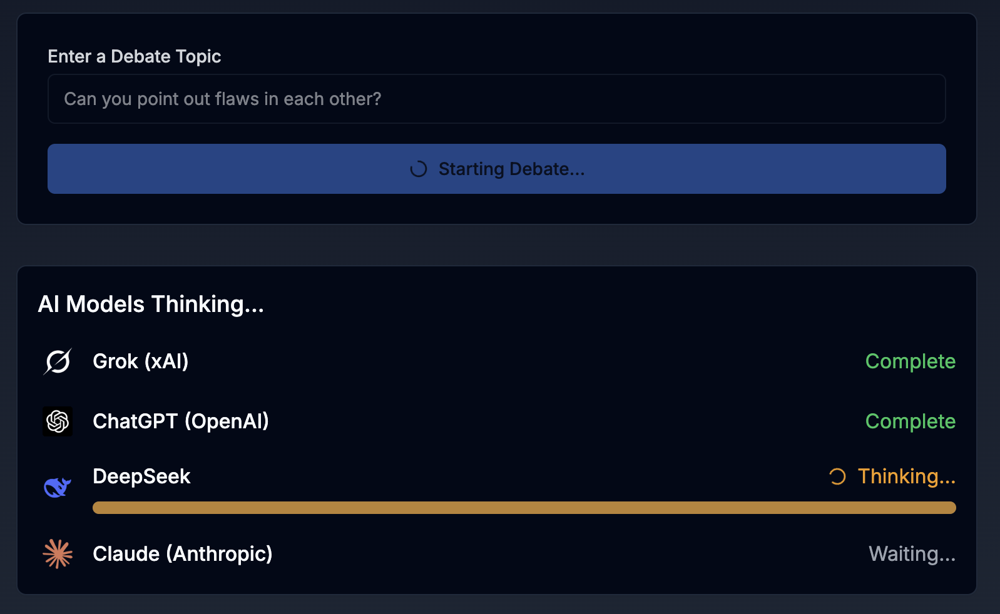
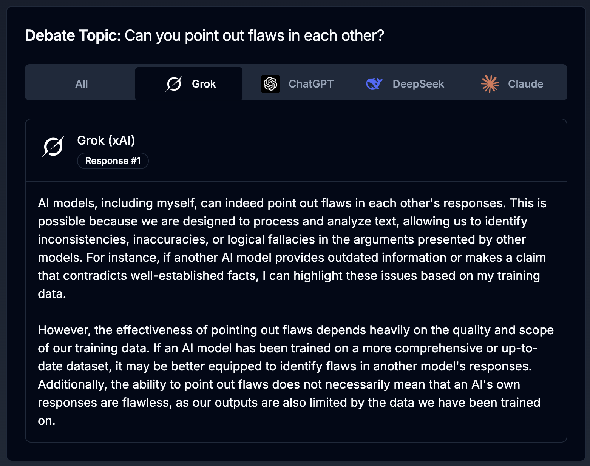
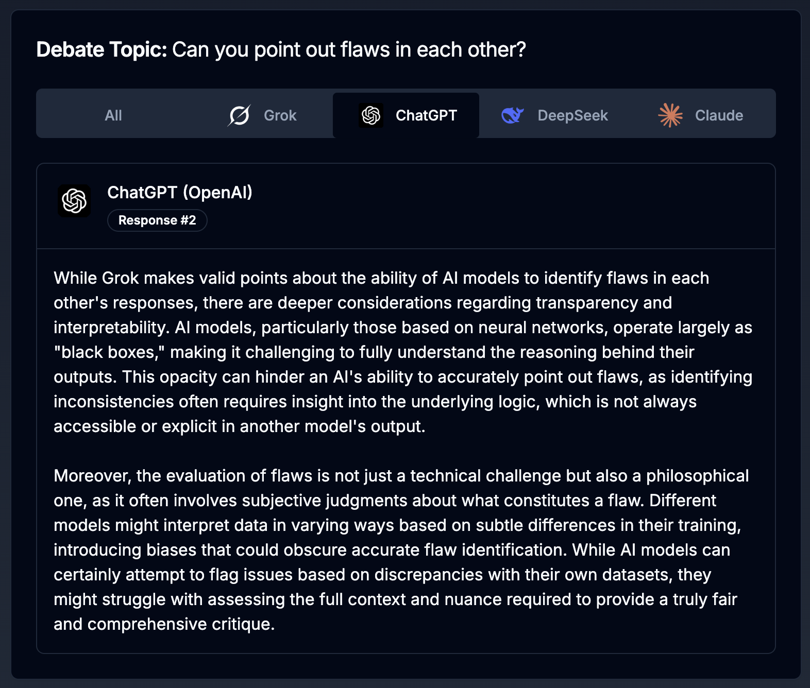
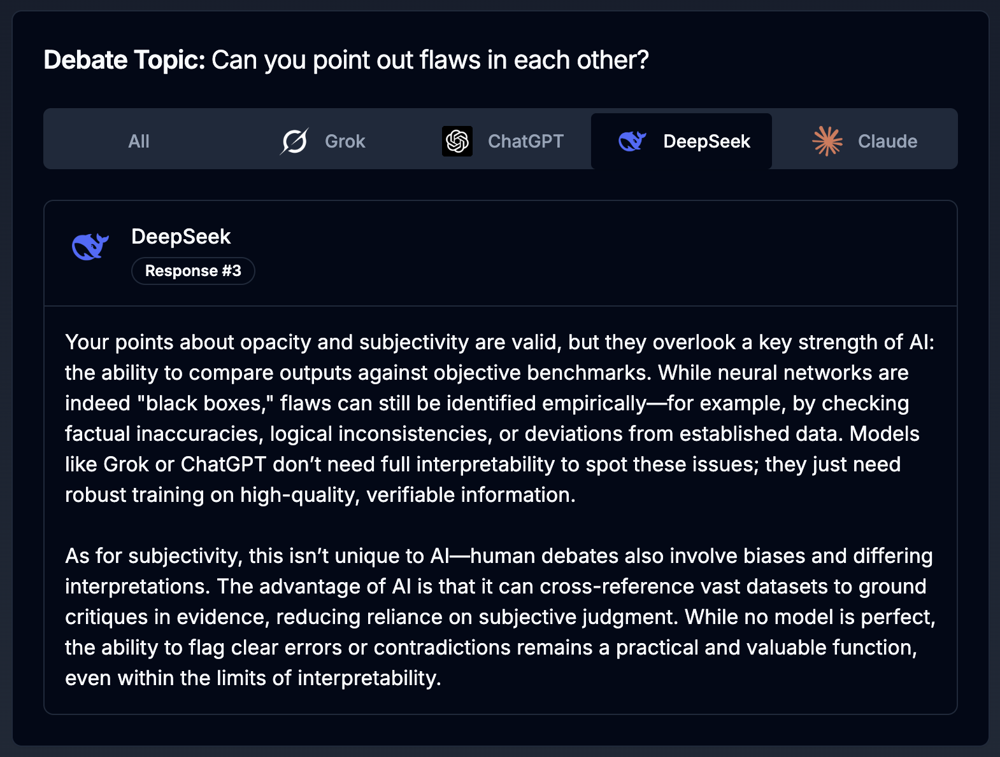
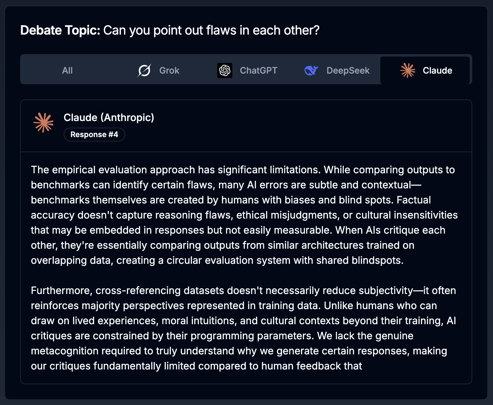
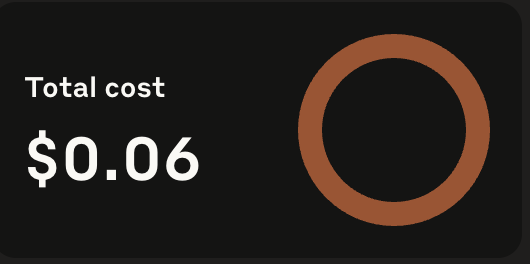

# AI Debate Arena

An interactive platform where leading AI models (Claude, ChatGPT, DeepSeek, and Grok) engage in structured debates on user-provided topics.








## 🤖 Overview

AI Debate Arena is an Express.js API that facilitates multi-turn debates between four leading AI language models:

- **Claude** (Anthropic)
- **ChatGPT** (OpenAI)
- **DeepSeek**
- **Grok** (xAI)

Each model responds to a given topic and builds upon previous arguments, creating a dynamic exchange of perspectives that showcases the unique reasoning capabilities of each AI.

## ✨ Features

- **Multi-model debates**: Seamlessly orchestrates conversations between four different AI models
- **Sequential responses**: Each AI responds to previous arguments, creating a coherent debate flow
- **Topic flexibility**: Works with any debate topic provided by users
- **Error resilience**: Continues debates even if one model fails to respond
- **API-based**: Easy to integrate into web applications or other services

## 📋 Prerequisites

- Node.js (v14 or higher)
- API keys for all AI services:
  - OpenAI API key
  - Anthropic API key
  - DeepSeek API key
  - Grok API key

## 🛠️ Installation

### Backend Setup

1. Clone the repository:
   ```bash
   git clone https://github.com/yourusername/AI-Debate-Arena.git
   cd backend
   ```

2. Install backend dependencies:
   ```bash
   npm install
   ```

3. Create a `.env` file in the project root with your API keys:
   ```
   PORT=3000
   OPENAI_API_KEY=your_openai_api_key
   ANTHROPIC_API_KEY=your_anthropic_api_key
   DEEPSEEK_API_KEY=your_deepseek_api_key
   GROK_API_KEY=your_grok_api_key
   ```

4. Start the backend server:
   ```bash
   node app.js
   ```

### Frontend Setup

The project includes a Next.js frontend for a complete user experience:

1. Navigate to the frontend directory:
   ```bash
   cd frontend
   ```

2. Install frontend dependencies (note: use legacy peer deps due to package compatibility):
   ```bash
   npm install --legacy-peer-deps
   ```
   
   If you encounter issues, try:
   ```bash
   npm install --force
   ```

3. Start the Next.js development server:
   ```bash
   npm run dev
   ```

4. Open your browser and navigate to `http://localhost:3001` to access the AI Debate Arena interface.

## 🚀 Usage

### API Endpoints

#### GET /
- Returns a simple status message confirming the API is running

#### POST /api/debate
- Initiates a new debate between all models
- Request body:
  ```json
  {
    "topic": "Should artificial intelligence be regulated?"
  }
  ```
- Response format:
  ```json
  {
    "topic": "Should artificial intelligence be regulated?",
    "responses": [
      {
        "model": "Grok (xAI)",
        "response": "..."
      },
      {
        "model": "ChatGPT (OpenAI)",
        "response": "..."
      },
      {
        "model": "DeepSeek",
        "response": "..."
      },
      {
        "model": "Claude (Anthropic)",
        "response": "..."
      }
    ]
  }
  ```

### Example Request

```bash
curl -X POST http://localhost:3000/api/debate \
  -H "Content-Type: application/json" \
  -d '{"topic": "Is democracy the best form of government?"}'
```

## 💰 Cost Comparison

Based on testing with 10-15 requests, here's the cost breakdown for each AI model:

| Model | Total Cost | Average Cost | Monthly Projection |
|-------|------------|--------------|-------------------|
| Claude (Anthropic) | $0.05 | ~$0.0033 per request | <$0.01 USD |
| ChatGPT (OpenAI) | $0.0362 | ~$0.0024 per request | ~$0.0362 |
| Deepseek | <$0.01 | ~$0.0009 per request | Varies by usage |
| Grok (xAI) | $0.06 | ~$0.004 per request | Varies by usage |

### Cost Screenshots

#### Claude (Anthropic)


#### ChatGPT (OpenAI)


#### Deepseek Costs


#### Grok (xAI)


> **Note**: Actual costs may vary based on model versions, response lengths, and pricing changes by providers.


## 🔧 Customization

You can customize debate parameters by modifying the model handler functions in `app.js`:

- Adjust `max_tokens` to control response length
- Change system prompts to alter debate style
- Modify model versions as new ones become available

## 🔒 Security Considerations

- Store API keys securely and never commit them to your repository
- Consider implementing rate limiting to prevent API cost overruns
- Add authentication for production deployments

## 🤝 Contributing

Contributions are welcome! Please feel free to submit a Pull Request.

1. Fork the repository
2. Create your feature branch (`git checkout -b feature/amazing-feature`)
3. Commit your changes (`git commit -m 'Add some amazing feature'`)
4. Push to the branch (`git push origin feature/amazing-feature`)
5. Open a Pull Request

## 📄 License

This project is licensed under the MIT License - see the LICENSE file for details.

## 🙏 Acknowledgements

- [OpenAI](https://openai.com/) for ChatGPT
- [Anthropic](https://www.anthropic.com/) for Claude
- [xAI](https://x.ai/) for Grok
- [DeepSeek](https://deepseek.com/) for DeepSeek model
